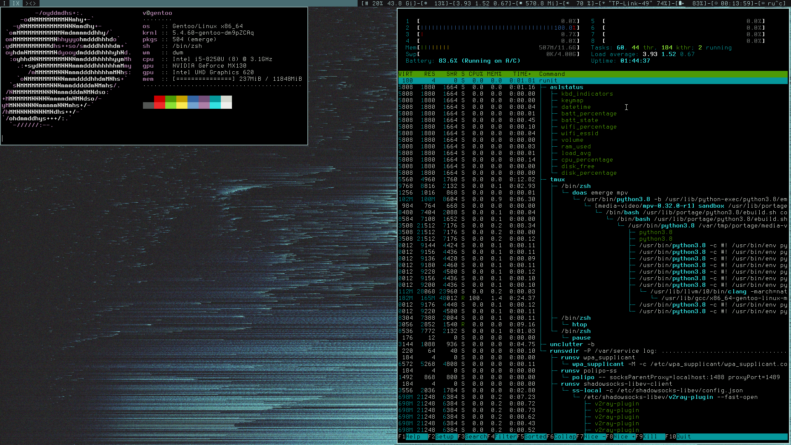

---
# compile

it is sucssefuly compiling with
* `clang`
* `tcc`
* `gcc`

you can find out more in [config.mk](config.mk)

and add some optimization with uncomenting `LTO` and `OPT`


---
# config

for more info about configs see [config.h](config.h)

alsu you can change `BUFF_SZ` (see [util.h](util.h))

to use ALSA:
```bash
make AUDIO=ALSA
```
pulseaudio in development (see [there](#pulseaudio))

---
# components/

components were taken from [slstatus](https://tools.suckless.org/slstatus)
and have been modified to work with `pthread`,
some have been completely rewritten

all components are tested in `Linux`

if you are using `OpenBSD` or `FreeBSD`, please tell me if it works corectly,
or if you have any problems


---
### manual updating

just send `USR1` signal to thread which you want to update


---
### how to create you own component

create file with `.c` extension in [components/](components/)

with:
```c
#include "../util.h"  /* you can find some usefull functiuns in `util.c` */

void
function_name(char *out, const char *arg, unsigned int interval)
{
	bptintf(out, "%s", "Hello, World!");
}

```

`interval` and `arg` is optional argument


then put:
```c
void function_name(char *, const char *, unsigned int);
#define function_name {function_name, "thread name"}

```

at the end of [aslstatus.h](aslstatus.h)


---
### pulseaudio
not yet implemented at all with `C` (see [components/volume.c](components/volume.c)),
but you can temporary use `run_command` with `pulse_volume` (see [config.h](config.h))

if anyone can help me with it, then i will gladly accept yours pull requests
(if they don't **suck** to much)

you can find some demo code in [TODO/pulse.c](TODO/pulse.c)

but it has problems using with threads as [component](components/volume.c)


---
# TODO
* rewrite `run_command` to redirect *stderr* to `/dev/null`
* add pulseaudio support
